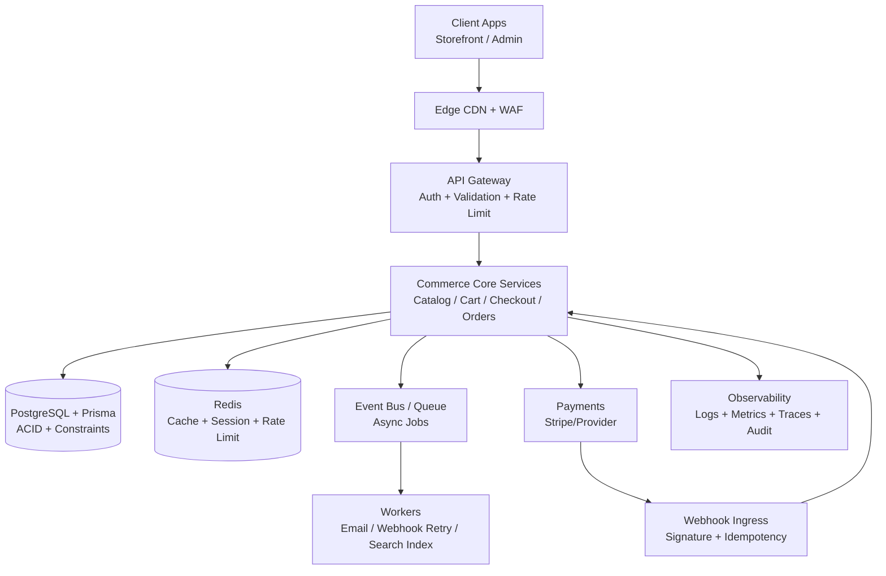

# Luxury Commerce System Architecture (Production-Ready)

## 1) High-level blueprint

## 2) Core reliability patterns
- **Strict contracts:** Zod schemas shared from `packages/types` between API and clients.
- **Data integrity first:** PostgreSQL constraints + FK + unique keys in Prisma schema.
- **Concurrency safety:** transactional stock decrement and idempotent payment flow.
- **Failure handling:** retry policies, DLQ (dead-letter queue), circuit breaker on external providers.
- **Security baseline:** RBAC, CSRF, CSP, secure cookies, webhook signature verification.

## 3) Recommended deployment layout
- **Edge:** CDN + WAF (Cloudflare/Fastly).
- **Apps/API:** containerized workloads (Kubernetes/ECS/Fly/Render).
- **Database:** managed PostgreSQL with read replica.
- **Queue:** Redis/BullMQ, SQS, or RabbitMQ.
- **Monitoring:** OpenTelemetry + Datadog/New Relic/Grafana stack.

## 4) SLO starter set
- API p95 latency < 250ms (read), < 500ms (write)
- Error rate < 0.5%
- Checkout success rate > 98%
- Payment webhook processing success > 99.9%
